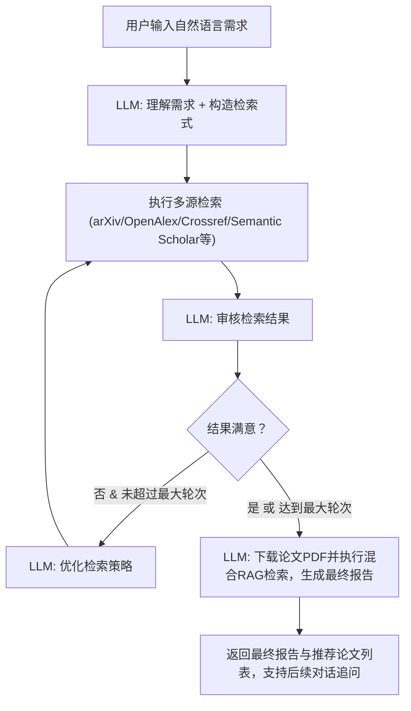

# ArXiv 论文检索 Agent

基于 DeepSeek v3.2 大模型 API，实现自然语言驱动的 arXiv 论文检索智能代理。

## 背景

用户希望通过自然语言描述论文检索需求，由 Agent 自动完成：理解需求 → 构造检索式 → 执行检索 → 审核结果 → 决定是否迭代优化。项目目的是理解 Agent 运作原理，不使用现成 MCP 框架。

## User Review Required

> [!IMPORTANT]
> **DeepSeek API Key**: 需要提供 DeepSeek API Key，将通过环境变量 `DEEPSEEK_API_KEY` 或在 UI 中输入。

> [!IMPORTANT]
> **模型选择**: 计划使用 `deepseek-v4-flash` 模型，base_url 为 `https://api.deepseek.com`。请确认这是您期望的配置。

## 项目结构

```
ArxivAgent/
├── .venv/                      # 虚拟环境
├── prompts/                    # 所有提示词模板（纯文本，中文）
│   ├── system.txt              # Agent 系统提示词
│   ├── query_parse.txt         # 理解用户需求、构造检索式
│   ├── result_review.txt       # 审核检索结果
│   ├── refine_query.txt        # 优化检索策略
│   ├── error_recovery.txt      # 检索异常时的恢复策略
│   ├── followup_chat.txt       # 对话追问提示词模板
│   └── summary.txt             # 生成最终摘要报告
├── core/                       # 核心模块
│   ├── __init__.py
│   ├── llm.py                  # DeepSeek API 封装（支持流式）
│   ├── arxiv_search.py         # arXiv API 检索封装
│   ├── search_service.py       # 统一的多源检索、缓存与排序服务
│   ├── pdf_parser.py           # PDF 下载、文本提取与分块
│   ├── rag.py                  # 本地混合 RAG 检索器 (Qdrant + BM25S + RRF)
│   ├── memory.py               # 对话与检索记忆管理
│   ├── agent.py                # Agent 主循环逻辑
│   └── exporter.py             # 导出功能（Markdown / JSON / CSV / PDF 等）
├── index.html                  # 现代化单页前端
├── app.py                      # FastAPI Web 服务入口
├── config.py                   # 配置管理
├── VERSION                     # 应用版本号
├── requirements.txt            # 依赖清单
└── README.md                   # 项目说明
```

## Proposed Changes

### 1. 环境与依赖

#### [NEW] requirements.txt
```
openai>=1.0.0
requests
python-dotenv
pypdf
fastapi
uvicorn
qdrant-client[fastembed]>=1.14.1
bm25s>=0.2.14
```

依赖说明：
- `openai`: DeepSeek API 兼容 OpenAI SDK，无需额外库
- `requests`: 用于访问各大开放学术数据库 API 的 HTTP 请求
- `python-dotenv`: 加载本地 `.env` 环境变量配置文件
- `pypdf`: 用于从本地缓存的 PDF 论文文件中提取完整文本
- `fastapi` 与 `uvicorn`: Web 服务框架及 ASGI 服务器
- `qdrant-client[fastembed]`: 用于本地 FastEmbed 向量化与本地 Qdrant 向量库（dense 检索）
- `bm25s`: 纯 Python 实现的超快速 BM25 关键词索引（sparse 检索）

---

### 2. 配置管理

#### [NEW] config.py

- 从环境变量或 UI 输入读取 `DEEPSEEK_API_KEY`
- 配置 arXiv API 基础 URL、速率限制（3秒间隔）
- 配置 DeepSeek 模型名称（默认为 `deepseek-v4-flash`）、base_url
- 配置最大检索迭代次数（默认3轮）、每轮最大结果数（默认10）
- 多源检索提供商配置（支持 arxiv, openalex, crossref, semantic_scholar 等，可设定超时与缓存 TTL）
- RAG 检索器相关配置（检索类型、Embedding 模型、Qdrant 存储路径、RRF 参数及重排开关等）

---

### 3. 提示词模板（全部中文纯文本）

#### [NEW] prompts/system.txt
Agent 系统身份定义：你是一个专业的学术论文检索助手，专注于 arXiv 论文检索...

#### [NEW] prompts/query_parse.txt
接收用户自然语言需求 → 输出结构化 JSON：
```json
{
  "keywords": ["关键词1", "关键词2"],
  "categories": ["cs.AI", "cs.CL"],
  "authors": [],
  "date_range": null,
  "sort_by": "relevance",
  "max_results": 10,
  "arxiv_query": "构造好的arXiv检索式"
}
```

#### [NEW] prompts/result_review.txt
审核检索结果，判断相关性，输出 JSON：
```json
{
  "relevant_papers": [...],
  "quality_score": 0.7,
  "should_refine": true,
  "reason": "检索词过于宽泛，建议缩小范围...",
  "suggestions": ["添加关键词X", "限定类别Y"]
}
```

#### [NEW] prompts/refine_query.txt
根据上一轮审核反馈，优化检索策略，输出新的检索式。

#### [NEW] prompts/error_recovery.txt
检索出错时的恢复策略，解析错误并重试生成更好的检索条件。

#### [NEW] prompts/followup_chat.txt
对话追问提示词模板，指导 Agent 结合之前生成的最终报告及本地 RAG 检索到的分块来回答用户后续问题。

#### [NEW] prompts/summary.txt
生成最终检索报告摘要。

---

### 4. 核心模块

#### [NEW] core/llm.py
DeepSeek API 封装：
- `stream_chat(messages, prompt_template, variables)`: 流式调用，yield 每个 token
- `chat(messages, prompt_template, variables)`: 非流式调用，返回完整响应
- `parse_json_response(text)`: 从 LLM 输出中提取 JSON
- 使用 `openai` 库，`base_url="https://api.deepseek.com"`

#### [NEW] core/arxiv_search.py
arXiv 检索封装：
- `search(query, max_results, sort_by, sort_order)`: 执行检索
- `parse_atom_response(xml_text)`: 解析 Atom XML 响应
- 返回结构化论文列表：`[{title, authors, abstract, categories, published, link, pdf_link}]`
- 遵守 3 秒间隔的速率限制

#### [NEW] core/search_service.py
多源检索、去重、缓存与排序服务：
- 适配多个论文来源（如 arXiv, OpenAlex, Crossref, Semantic Scholar）
- 提供查询条件简化及论文去重（基于 DOI 或标题规范化）
- 基于标题与摘要的 TF-IDF 文本相似度与引用量/PDF 存在性等特征进行综合排序评估

#### [NEW] core/pdf_parser.py
PDF 下载与提取：
- 从论文链接异步/同步下载 PDF 文件，并缓存至本地目录
- 使用 `pypdf` 从 PDF 文件中提取完整文本，并切分为带有重叠边界的定长文本块（Chunks）

#### [NEW] core/rag.py
轻量级本地混合 RAG 检索器：
- 包含基于 TF-IDF 余弦相似度的基础检索器（无外部依赖兜底）
- 包含基于 FastEmbed (本地 dense 向量化) + Qdrant local mode (向量存储库) + BM25S (关键词 sparse 检索) 并结合 RRF 融合与重排（Rerank）的混合检索器

#### [NEW] core/memory.py
记忆管理：
- `ConversationMemory`: 存储完整对话历史
- `SearchMemory`: 存储每轮检索的查询、结果、审核反馈
- `add_round(query, results, review)`: 添加一轮检索记忆
- `get_context()`: 获取记忆上下文供 LLM 参考
- `get_search_history()`: 获取所有检索历史

#### [NEW] core/agent.py
Agent 主循环（核心）：

```
用户输入 → [理解需求] → 构造检索式 → [多源检索] → [审核结果]
                                                        ↓
                                            需要优化？ → 是 → [优化策略] → 重新构造检索式 → ...
                                                        ↓
                                                        否 → [生成报告] → 返回结果
```

- `ArxivAgent` 类：
  - `run(user_query)`: 主循环，generator 函数，yield 每个步骤的状态和内容
  - 每个步骤 yield `AgentEvent` 对象：
    - `type`: "thinking" | "searching" | "reviewing" | "refining" | "done" | "error"
    - `content`: 文本内容（流式 token 或完整文本）
    - `data`: 结构化数据（检索结果、审核报告等）
  - 最大迭代次数限制，防止无限循环
  - 每一步都有清晰的状态通知

#### [NEW] core/exporter.py
导出功能：
- `export_conversation(memory, format)`: 导出对话历史 → Markdown
- `export_search_results(results, format)`: 导出检索结果列表 → Markdown / CSV / JSON
- `export_final_report(report, format)`: 导出最终报告 → Markdown

---

### 5. Web UI

#### [NEW] app.py 与 index.html

使用 FastAPI 构建 Web 服务后端，结合单页 HTML/CSS/JS (SSE) 实现流式交互界面：

**布局设计**：
```
┌─────────────────────────────────────────────────────────┐
│  🔍 多源论文检索 Agent                       [API 配置面板]│
├──────────────────────────────┬──────────────────────────┤
│                              │                          │
│     主对话历史                │    当前轮次检索结果面板  │
│     (支持实时流式思维展示)    │  (表格形式，支持 DOI 与 PDF)│
│                              │                          │
│                              │                          │
│                              │                          │
├──────────────────────────────┼──────────────────────────┤
│  [用户输入框]       [发送]    │  📊 最终论文推荐报告     │
│                              │  (富文本 Markdown 渲染)  │
├──────────────────────────────┴──────────────────────────┤
│  [导出当前对话] [导出文献表(MD/CSV/JSON)] [导出报告] [清除状态] │
└─────────────────────────────────────────────────────────┘
```

**流式与交互实现**：
- 后端使用 `StreamingResponse` 返回 `application/x-ndjson` 格式数据，支持将思维（Thinking）、搜索（Searching）、审核（Review）、优化（Refining）、报告生成（Report）以及后续对话追问实时推送。
- 前端利用 EventStream 规范读取数据，并进行优雅的 Markdown 渲染。
- 支持一键导出不同文件格式，并可在后续追问中无缝使用混合 RAG 检索对论文内容进行准确引用。

---

## Agent 循环流程详解



每一步都会：
1. 通过流式 yield 将 LLM 输出实时展示给用户
2. 将当前步骤信息存入 Memory
3. 更新 UI 状态

## Open Questions

> [!IMPORTANT]
> 1. DeepSeek API Key 是否已准备好？还是需要支持其他模型作为备选？
> 2. 是否需要支持代理（proxy）配置？（考虑到 API 访问可能需要）
> 3. 导出格式偏好：目前计划支持 Markdown、CSV、JSON，是否有其他需求？

## Verification Plan

### Automated Tests
1. 创建虚拟环境并安装依赖后，确认所有模块可以正常导入
2. 运行 `python app.py` 确认 FastAPI Web 服务正常启动并在端口 7860 监听
3. 通过浏览器访问 UI，测试完整的检索流程

### Manual Verification
1. 输入一个测试查询（如 "最近关于大语言模型推理能力的论文"）验证完整流程
2. 确认流式输出正常工作
3. 测试导出功能（Markdown, CSV, JSON 导出）
4. 验证所有提示词文件可读、格式正确
